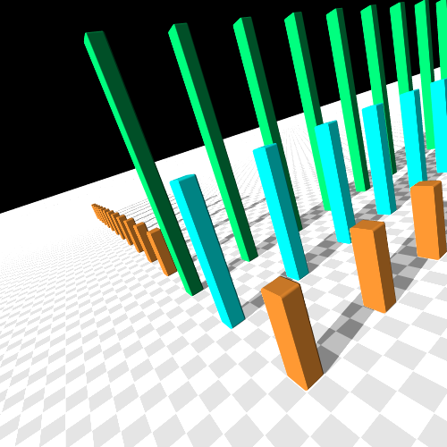
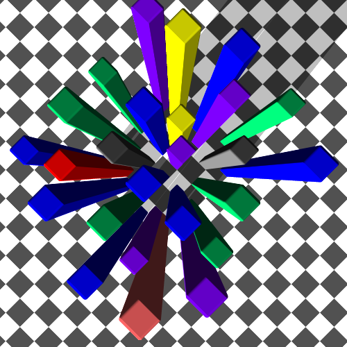
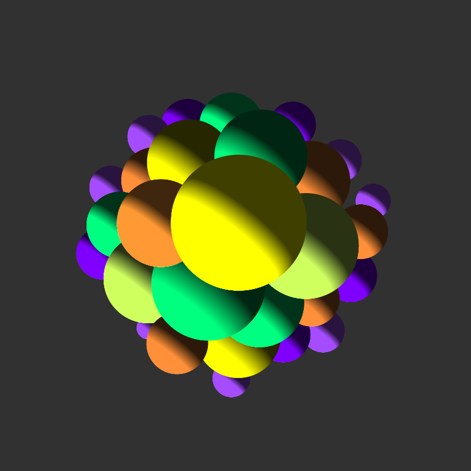

<div align="center">

# Qt Ray Tracer

**A physically based ray tracer written in C++, with a Qt desktop front end. Every pixel below was traced by this code.**


&nbsp;
&nbsp;


<sub>Left to right: the "practical" pillar scene, a bird's-eye skyscraper city, and a sphere cluster. All are 500×500, 25 jittered samples per pixel.</sub>

</div>

---

## What it is

A from-scratch study of how photorealistic images are made. Rays are fired from a virtual camera through every pixel and bounced off geometry. For each hit, the renderer decides how light, materials and shadows combine into a final colour. The Qt app streams pixels to the window as they are traced, so you can watch the image appear.

## Capabilities

| | |
|---|---|
| **Cameras** | Pinhole, thin-lens (depth of field), fisheye, spherical (panoramic), orthographic, stereo pairs |
| **Tracers** | Ray casting, Whitted-style recursive reflection and refraction, area lighting with soft shadows |
| **Materials** | Matte, Phong, plastic, reflective, glossy reflector, transparent, dielectric (Fresnel), emissive |
| **Lights** | Ambient, ambient occlusion, point, directional, area, environment |
| **Sampling** | Regular, pure random, jittered, multi-jittered, n-rooks, Hammersley anti-aliasing |
| **Geometry** | Spheres, planes, boxes, beveled boxes, cylinders, cones, tori and partial shapes, bowls, archways, instancing, uniform grids for acceleration, triangle meshes |
| **Textures** | 3D checkers, wood, fBm noise, ramp and wrapped noise, image textures with spherical, cylindrical and light-probe mappings |

## Build and run

Open `raytracer_spheres.pro` in **Qt Creator** (Qt 6.6) and press **Run**, or:

```sh
qmake raytracer_spheres.pro && make
```

Scenes are assembled in `World/Worlds.cpp` (e.g. `build_practical`, `build_city`, `build_spheres`). Pick one in `World::build()` and set the camera in `World::init_cameras()`.

## Project layout

```
Cameras/  Tracers/  Materials/  BRDFs/  BTDFs/  Lights/
Samplers/ Textures/ Mappings/   GeometricObjects/   Noises/
World/          scene setup, view plane and scene builders
UserInterface/  Qt render thread + canvas (pixels stream in live)
```

## Credits

Built by **Roszhan Raj** for CSUF computer graphics coursework. The core framework follows Kevin Suffern's *Ray Tracing from the Ground Up* (© Kevin Suffern 2000–2008), whose code is for non-commercial use under the GNU GPL v2. Original copyright notices are kept in each file. The Qt interface (`UserInterface/`, `mainwindow.*`) and scene-building code were added for the course.
